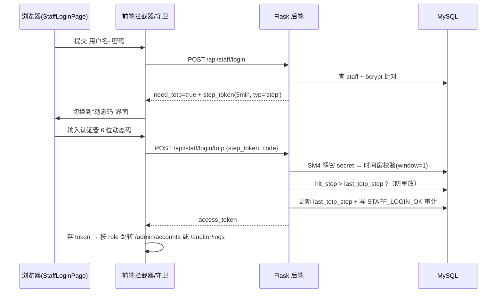
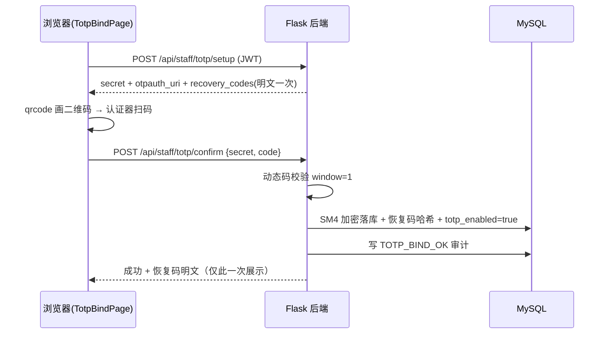
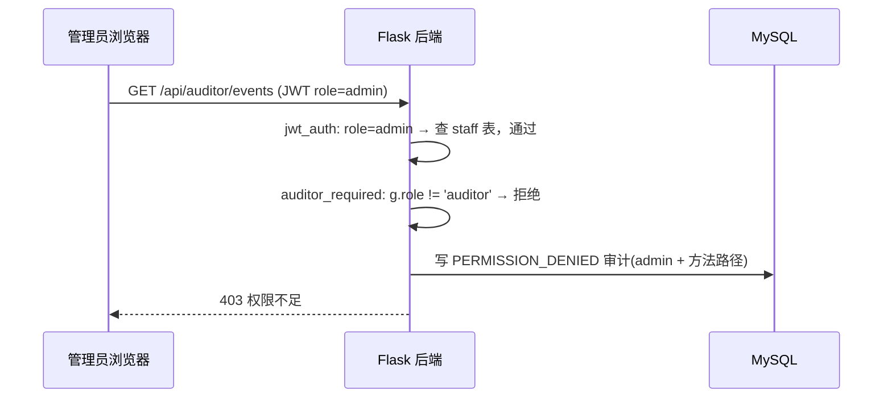

# 安全电子商务系统 —— 第 2 周里程碑代码详解

> 范围：**RBAC 角色权限控制 + TOTP 双因素认证 + 后台管理员/审计员功能 + 日志体系（数据库审计日志 + 运行日志）**
> 技术栈：Flask + SQLAlchemy + MySQL（后端）｜Vue3 + Vite + Pinia + ant-design-vue（前端）
> 本文逐文件解释"新写的代码"：**做什么、为什么、怎么工作、关键代码片段**，可直接作为课程设计说明素材。

---

## 目录

1. [本次改了什么（总览）](#1-本次改了什么总览)
2. [涉及文件清单](#2-涉及文件清单)
3. [RBAC 权限模型：数据表与认证授权链路](#3-rbac-权限模型数据表与认证授权链路)
4. [TOTP 双因素认证原理与本项目实现](#4-totp-双因素认证原理与本项目实现)
5. [后端接口逐模块讲解](#5-后端接口逐模块讲解)
6. [前端代码讲解](#6-前端代码讲解)
7. [日志体系（审计日志 + 运行日志）](#7-日志体系审计日志--运行日志)
8. [端到端时序图](#8-端到端时序图)
9. [安全机制核对表（答辩要点）](#9-安全机制核对表答辩要点)
10. [验证结果与演示步骤](#10-验证结果与演示步骤)
11. [已知限制与改进方向](#11-已知限制与改进方向)

---

## 1. 本次改了什么（总览）

按课程设计任务书第 2 周里程碑（RBAC + TOTP），在原有"前台商城（用户/商家双账户体系）"之外，新增了**独立的后台账号体系**：

| 改动 | 说明 |
|---|---|
| 新增 `staff` 表 | 管理员(`admin`) / 审计员(`auditor`) 账号，字段含角色、TOTP 加密密钥、恢复码哈希、防重放步号 |
| 后台两步登录 | 密码（第一步）→ TOTP 动态码 / 一次性恢复码（第二步），未绑定 TOTP 的账号强制先走绑定流程 |
| TOTP 绑定管理 | `setup` 生成密钥/二维码/恢复码 → `confirm` 动态码校验通过后**SM4 加密落库**启用 |
| RBAC 授权 | JWT 的 `role` 声明区分 user/seller/admin/auditor；新增 `admin_required` / `auditor_required` / `staff_required` 装饰器 |
| 管理员接口 | 查看/禁用/启用/删除 用户与商家账号、查看/删除全部商品（写操作全部审计留痕） |
| 审计员接口 | 分页/过滤查看安全审计日志、导出 CSV（**只读**，最小权限） |
| 前端整套后台页面 | 后台登录页（两步 UI）、TOTP 绑定页（二维码）、账号管理、商品管理、审计日志（CSV 导出） |
| 日志体系 | ① 数据库审计日志：41 类事件"事件字典" + 统一入口 `log_audit` + 全面埋点；② 运行日志：logging 滚动写文件 `logs/backend.log` + 逐请求 REQ 访问日志 |

---

## 2. 涉及文件清单

### 2.1 后端（`后端flask/`）

| 文件 | 性质 | 作用 |
|---|---|---|
| `app/utils/db.py` | 修改 | 新增 `Staff` ORM 模型；`create_staff / get_staff_by_username / get_staff_by_id / update_staff / delete_staff / record_staff_failed_login / reset_staff_failed_login / get_all_users / get_all_sellers / get_all_products_paginated / query_security_events` |
| `app/utils/totp.py` | 新增 | RFC 6238 TOTP 标准库实现（密钥生成、动态码计算、时间窗校验、恢复码生成/哈希/校验、otpauth URI） |
| `app/utils/audit_log.py` | 新增 | 审计日志统一入口 `log_audit()`（带事件字典校验） |
| `app/utils/logging_config.py` | 新增 | 运行日志：RotatingFile 滚动文件 + before/after_request 访问日志钩子 |
| `config/audit_events.py` | 新增 | **审计事件字典**：41 类事件的权威清单 + 分组函数 |
| `app/middleware/jwt_auth.py` | 修改 | 认证通过后按 token 中 `role` 回查对应表：`admin/auditor` → `staff` 表；并把令牌的 `totp_ok` 声明注入 `g.totp_ok` |
| `app/middleware/permissions.py` | 修改 | 新增 `admin_required / auditor_required / staff_required`；统一 `_deny()` 记录 `PERMISSION_DENIED`；`admin/auditor` 额外要求令牌 `totp_ok=True`（未绑定/仅密码直登一律 403） |
| `app/api/staff/staff_login.py` | 新增 | 后台两步登录、`/api/staff/me`、登出；令牌按"是否两步验证通过"写入 `totp_ok` 声明 |
| `app/api/staff/staff_totp.py` | 新增 | TOTP 绑定 `setup/confirm` + SM4 加解密 TOTP secret |
| `app/api/staff/admin.py` | 新增 | 管理员 9 个管理接口 |
| `app/api/staff/auditor.py` | 新增 | 审计员查看/导出接口（只读） |
| `app/__init__.py` | 修改 | 注册 4 个 staff 蓝图；调用 `setup_logging(app)` |
| `app/api/v1/login.py` | 修改 | 前台登录补记 `USER_LOGIN_OK / USER_LOGIN_FAILED` |
| `seed_staff.py` | 新增 | 初始化脚本：建表 + 创建演示账号 `admin1 / audit1` |
| `docs/审计事件字典.md` | 新增 | 由事件字典导出的答辩交付文档 |

### 2.2 前端（`v1-zhognshe-rebuild-3-vue/src/`）

| 文件 | 性质 | 作用 |
|---|---|---|
| `request.js` | 修改 | 统一携带 JWT；401 时按路径前缀分流跳转（staff 后台 → `/staff/login`，前台 → `/user/login`） |
| `api/staff.js` | 新增 | 后台全部接口的 axios 封装（登录两步/绑定/管理/审计导出 blob） |
| `store/useLoginUserStore.js` | 修改 | 新增 `fetchStaffMe()`（后台账号信息走 `/api/staff/me`，与前台 `/user/profile` 区分），保存 `totp_enabled` 供守卫判断 |
| `router/index.js` | 修改 | 新增 5 条 staff 路由；守卫按 `meta.roles` 做前端角色校验，staff 路由每次都调 `fetchStaffMe`，未绑定 TOTP 的后台账号强制跳绑定页 |
| `App.vue` | 修改 | `/staff/login` 整页渲染（不进公共布局）；watch 跳过 staff 路径 |
| `components/GlobalHeader.vue` | 修改 | admin 显示 账号管理/商品管理/TOTP设置；auditor 显示 审计日志/TOTP设置；右角用户名下拉新增 **退出登录**（清 token + 重置 store，按角色调 staff/user 登出接口） |
| `pages/staff/StaffLoginPage.vue` | 新增 | 两步登录页（password → totp / recovery 的状态机） |
| `pages/staff/TotpBindPage.vue` | 新增 | TOTP 绑定页（qrcode 库把 otpauth URI 画成二维码、密钥复制、恢复码一次性展示） |
| `pages/staff/AdminAccountsPage.vue` | 新增 | 账号管理（全部/用户/商家 过滤 + 禁用/启用/删除） |
| `pages/staff/AdminProductsPage.vue` | 新增 | 商品管理（状态过滤 + 名称搜索 + 删除任意商品） |
| `pages/staff/AuditLogPage.vue` | 新增 | 审计日志（事件类型/日期过滤 + CSV 导出下载） |
| `package.json` | 修改 | 新增依赖 `qrcode` |

---

## 3. RBAC 权限模型：数据表与认证授权链路

### 3.1 权限矩阵（任务书确定，代码逐一落地）

| 角色 | 可执行操作 | 代码落点 |
|---|---|---|
| `user` 买家 | 浏览商品、加购、下单、管理自己的资料/订单 | 原有 v1 接口（`user_required` 等） |
| `seller` 卖家 | 管理自己发布的商品 + 自己的资料 | 原有 v1 接口（`seller_required`） |
| `admin` 管理员 | 查看/禁用/启用/删除 用户与商家账号；查看/删除全部商品 | `admin.py`（全部挂 `@admin_required`） |
| `auditor` 审计员 | 只读：查看/导出审计日志 | `auditor.py`（全部挂 `@auditor_required`） |

### 3.2 为什么需要独立的 `staff` 表

前台 `user` / `seller` 是两套业务账户表。管理员/审计员是**系统管理身份**，如果复用 `user` 表：
- 语义混乱（`user.role` 只有 `user/seller` 两种业务角色）；
- TOTP 密钥、恢复码等安全字段会污染前台表；
- 无法表达"后台账号与前台账号同名互不影响"。

所以新增独立表，并与前台表**完全隔离**：

```python
class Staff(Base):
    __tablename__ = 'staff'
    id = Column(Integer, primary_key=True, autoincrement=True)
    username = Column(String(500), nullable=False, unique=True)
    password = Column(String(100), nullable=False)               # bcrypt 密文
    role = Column(String(50), nullable=False, default='admin')   # 'admin' | 'auditor'
    permissions = Column(Text, nullable=True)                    # 兼容 JWT 签发
    is_active = Column(Boolean, nullable=False, default=True)    # 禁用立即失效
    failed_attempts = Column(Integer, nullable=False, default=0)
    lock_until = Column(DateTime, nullable=True)
    totp_secret_enc = Column(Text, nullable=True)                # SM4 加密后的 TOTP secret
    totp_enabled = Column(Boolean, nullable=False, default=False)
    recovery_hashes = Column(Text, nullable=True)                # JSON 数组 [sha256,...]
    last_totp_step = Column(BigInteger, nullable=True)           # 防重放：最近成功时间步
    created_at = ...
    updated_at = ...
```

### 3.3 认证链路改造：JWT 按 role 回查正确数据表

原有 `jwt_auth_required` 只查 `user/seller` 表。新增 staff 体系后，令牌里的 `role` 声明决定查哪张表——**以数据库最新状态为准**，实现"封号/禁用立即生效"：

```python
# jwt_auth.py（第 4 步：账号状态二次校验）
user_id = int(payload.get('sub'))
role = payload.get('role')

if role == 'seller':
    user_or_seller = db.get_seller_by_id(user_id)
elif role in ('admin', 'auditor'):          # ← 新增：后台账号查 staff 表
    user_or_seller = db.get_staff_by_id(user_id)
else:
    user_or_seller = db.get_user_by_id(user_id)

if not user_or_seller or not user_or_seller.is_active:
    return jsonify({'code': 401, 'error': '未授权访问',
                    'message': '用户已被禁用', ...}), 401
```

`Staff` 对象字段（`id/username/role/permissions`）与 `auth.generate_access_token()` 的鸭子类型读取一致，因此后台登录成功后**直接复用**原有签发函数即可（见 5.1）。

### 3.4 授权层：角色装饰器

`permissions.py` 在原有 `seller_required / user_required` 基础上新增三个后台装饰器，并统一 `_deny()`：

```python
def _deny(message: str):
    """403 拒绝 + 越权尝试写审计日志（PERMISSION_DENIED）"""
    if hasattr(g, 'username'):
        audit_log.log_audit('PERMISSION_DENIED', g.username,
            f'越权访问被拒绝: {request.method} {request.path} '
            f'(role={getattr(g, "role", None)})')
    return jsonify({'code': 403, 'error': '权限不足', 'message': message, ...}), 403

def admin_required(f):
    @wraps(f)
    def decorated_function(*args, **kwargs):
        if not hasattr(g, 'role') or g.role != 'admin':
            return _deny('需要管理员权限')
        # ★ 双因素强制：只有“密码 + TOTP/恢复码”两步登录签发的令牌(totp_ok=True)
        #   才允许使用后台功能；未绑定 TOTP 的账号即使密码直登拿到令牌，
        #   这里也一律 403 —— 必须先完成绑定、再用动态码重新登录（见 5.1）
        if not getattr(g, 'totp_ok', False):
            return _deny('请先完成TOTP绑定，再用“密码+动态码”重新登录')
        return f(*args, **kwargs)
    return decorated_function
```

> `auditor_required` 同构（要求 `role == 'auditor'`，同样校验 `totp_ok`）；`staff_required` 是**复合判断**（`role in ('admin','auditor')`），供 `/api/staff/me`、TOTP 绑定这类两种后台角色都能访问的接口使用——如果拆成两个装饰器反而会互相拦掉另一半角色。
>
> **`totp_ok` 声明从哪来**：只有两步登录（`/api/staff/login/totp`、`/api/staff/login/recovery`）签发的令牌带 `totp_ok=True`（见 5.1 的 `_issue_access_token(staff, totp_ok=True)`）；仅密码登录（含未绑定直登）签发的令牌 `totp_ok=False`，**即使之后完成了绑定，旧令牌依然不能调后台接口**——必须重新走两步登录换新令牌。`jwt_auth` 中间件把该声明注入 `g.totp_ok` 供授权层读取。

**认证在前、授权在后**的装饰器堆叠顺序（答辩常问）：

```python
@user.route('/api/admin/users', methods=['GET'])
@rate_limit(max_requests=60, window_seconds=60, per_ip=True)  # ① 限流（最外层）
@jwt_auth_required        # ② 认证：验 token、注入 g.role / g.user_id
@admin_required           # ③ 授权：比对 g.role == 'admin'
def admin_list_accounts(): ...
```

---

## 4. TOTP 双因素认证原理与本项目实现

### 4.1 TOTP（RFC 6238）原理一句话

TOTP = 基于**时间**的一次性口令：客户端与服务端共享一个 Base32 密钥 `secret`，各自用 `HMAC-SHA1(secret, 当前时间步)` 算出 6 位动态码。时间步 = `当前Unix秒 // 30`（每 30 秒换一次码），双方只要时钟大致同步就能算出相同数字。

计算过程：`时间步(8字节大端) → HMAC-SHA1 → 动态截断(DT) → mod 10^6 → 补零成6位`。

### 4.2 `totp.py`：纯标准库实现

```python
def _dynamic_truncation(hmac_result: bytes) -> int:
    """动态截断：取 HMAC 结果最后 1 字节的低 4 位作偏移，再取 4 字节 & 0x7fffffff"""
    offset = hmac_result[-1] & 0xf
    binary = struct.unpack('>I', hmac_result[offset:offset + 4])[0]
    return binary & 0x7fffffff

def totp_code(secret: str, t=None) -> str:
    if t is None:
        t = int(time.time() // 30)                 # 当前时间步
    key = base64.b32decode(secret + '=' * (8 - len(secret) % 8))
    msg = struct.pack('>Q', t)                     # 时间步 → 8 字节大端
    h = hmac.new(key, msg, hashlib.sha1).digest()  # HMAC-SHA1
    return f'{_dynamic_truncation(h) % 1000000:06d}'

def verify_totp(secret, code, window=1):
    """时间窗校验：当前步 ± window 步内匹配即成功；返回 (是否成功, 命中步号)"""
    current_step = int(time.time() // 30)
    for offset in range(-window, window + 1):
        if totp_code(secret, current_step + offset) == code:
            return True, current_step + offset
    return False, -1
```

**为什么返回命中步号**？`window=1` 允许 ±30 秒的时钟误差，代价是"同一个码在 3 个时间步内都有效"——这正是**重放攻击**的口子。返回命中步号后，服务端记录该账号 `last_totp_step`，只接受**严格大于**上次成功步号的码（见 5.2），使每个时间步的码只能成功使用一次。

### 4.3 恢复码（备用登录手段）

认证器丢失（手机丢了）时不能永远锁死后台，所以绑定时生成 8 个一次性恢复码：

```python
def generate_recovery_codes(n=8, code_length=10):
    alphabet = 'ABCDEFGHJKLMNPQRSTUVWXYZ23456789'   # 去掉易混淆字符 O/0、I/1、L
    return [''.join(secrets.choice(alphabet) for _ in range(code_length)) for _ in range(n)]

def hash_recovery_codes(plain_codes):
    return [hashlib.sha256(c.encode()).hexdigest() for c in plain_codes]  # 只存哈希
```

恢复码**明文只在绑定成功那一刻返回前端展示一次**，数据库只存 SHA-256 哈希；使用后立即从哈希列表删除——每个码只能用一次（见 5.3）。

### 4.4 TOTP secret 的加密存储

即使后台数据库泄露，明文 Base32 密钥也不能直接暴露。落库前用项目已有的 **SM4-CBC**（国密，与支付数字信封共用密钥体系）加密：

```python
def encrypt_totp_secret(secret: str) -> str:
    iv = os.urandom(16)                                     # 随机 IV
    cipher = SM4.sm4_encrypt(_sm4_key(), iv, secret.encode('utf-8'))
    return iv.hex() + ':' + cipher.hex()                    # iv:密文 一起入库

def decrypt_totp_secret(stored: str) -> str:
    iv_hex, cipher_hex = stored.split(':', 1)
    plain = SM4.sm4_decrypt(_sm4_key(), bytes.fromhex(iv_hex), bytes.fromhex(cipher_hex))
    return plain.decode('utf-8')
```

CBC 模式每次加密用随机 IV，因此**同一 secret 两次加密的密文不同**；密钥从 `.env` 的 `SM4_KEY` 读取（32 位十六进制 = 16 字节），不硬编码。`decrypt_totp_secret` 在登录第二步从库中取出解密后做时间窗校验。

---

## 5. 后端接口逐模块讲解

### 5.1 `staff_login.py` —— 两步登录

**为什么必须"两步"而不是密码对了直接发 token？**
如果密码验证通过就签发正式 access token，攻击者只要拿到密码（撞库/弱密码）就能绕过 TOTP 直接进后台——两步认证就形同虚设。所以第一步只签发一枚**专用预登录令牌 `step_token`**：

```python
STEP_TOKEN_TTL_MIN = 5    # 5 分钟有效

def _issue_step_token(staff):
    payload = {
        'sub': str(staff.id), 'username': staff.username, 'role': staff.role,
        'typ': 'step',                                # 类型与 access token 区分
        'iat': ..., 'exp': now + 5min,
        'jti': secrets.token_urlsafe(16),
    }
    return jwt.encode(payload, auth.JWT_SECRET, algorithm=auth.JWT_ALG)

def _verify_step_token(step_token):
    try:
        payload = jwt.decode(step_token, auth.JWT_SECRET, algorithms=[auth.JWT_ALG])
        if payload.get('typ') != 'step':              # 只认 step 类型
            return None
        return payload
    except Exception:
        return None
```

`typ='step'` 防止把预登录令牌当正式令牌用；`verify_access_token`（auth.py）只认 `typ='access'`，所以即使拿到 step_token 也访问不了任何受保护接口。

**第一步 `POST /api/staff/login`（用户名+密码）** 的关键分支：

```python
if not staff:  # 与密码错误统一返回"用户名或密码错误"——防账号枚举
    return build_response(401, '用户名或密码错误', status=401)
...
if not my_bcrypt.compare_password(staff.password, password):
    db.record_staff_failed_login(staff)                    # 连续失败计数（达阈值锁定）
    audit_log.log_audit('STAFF_LOGIN_FAILED', username, f'后台账号密码错误: {username}')
    return build_response(401, '用户名或密码错误', status=401)

db.reset_staff_failed_login(staff)                         # 成功清零

if staff.totp_enabled:
    audit_log.log_audit('STAFF_LOGIN_STEP1', username, '...等待TOTP...')
    return build_response(0, '密码验证通过，请输入动态码', data={
        'need_totp': True, 'username': ..., 'role': ...,
        'step_token': _issue_step_token(staff),           # 只给预登录令牌
    })
# 未绑定 TOTP：发正式 token，但标记 totp_setup_required=True 让前端强制先绑定
return build_response(0, '登录成功', data={
    'need_totp': False, 'totp_setup_required': True,
    'access_token': _issue_access_token(staff), ...
})
```

**第二步 `POST /api/staff/login/totp`（动态码）**——含防重放核心：

```python
payload = _verify_step_token(step_token)
if not payload:
    return build_response(401, '预登录凭证无效或已过期，请重新登录', status=401)
...
secret = decrypt_totp_secret(staff.totp_secret_enc)   # SM4 解密库中密钥
ok, hit_step = totp.verify_totp(secret, code, window=1)
if not ok:
    audit_log.log_audit('STAFF_TOTP_FAILED', staff.username, '后台登录动态码验证失败')
    return build_response(401, '动态码错误', status=401)

# ★ 防重放：命中步号必须严格大于历史成功步号
if staff.last_totp_step is not None and hit_step <= staff.last_totp_step:
    audit_log.log_audit('STAFF_TOTP_REPLAY', staff.username,
                        f'后台登录动态码重放被拒绝 step={hit_step}')
    return build_response(401, '动态码已使用，请稍后重试', status=401)

db.update_staff(staff.id, last_totp_step=hit_step, audit=False)  # 记录成功步号
audit_log.log_audit('STAFF_LOGIN_OK', staff.username, '后台账号登录成功(TOTP通过)')
# totp_ok=True：两步验证通过，此令牌才被授权调用管理/审计接口
return build_response(0, '登录成功', data={'access_token': _issue_access_token(staff, totp_ok=True), ...})
```

> 细节：`update_staff(..., audit=False)`——TOTP 步号每次登录都变，若走通用 `STAFF_UPDATE` 审计会高频刷屏，所以关闭通用审计，由更精确的 `STAFF_LOGIN_OK` 一条记录留痕（`update_staff` 的 `audit` 参数就是为此设计的）。
>
> **为什么“绑定完成后，绑定前的密码登录令牌仍然无效”**：令牌签发时就把 `totp_ok=False` 写死在 JWT 载荷里（不可篡改），授权层只认载荷声明、不查数据库当前状态——所以旧令牌在剩余有效期内始终没有后台权限；必须用动态码/恢复码重新登录换取 `totp_ok=True` 的新令牌。这一步与前端绑定页“保存恢复码，去重新登录”共同构成“先绑定、再两步登录、方可使用后台功能”的完整闭环。

**第二步备选 `POST /api/staff/login/recovery`（恢复码）**：命中后从哈希列表移除该码（一次性）：

```python
hashes = json.loads(staff.recovery_hashes) if staff.recovery_hashes else []
if not totp.verify_recovery_code(code, hashes):
    audit_log.log_audit('STAFF_RECOVERY_FAILED', staff.username, '恢复码校验失败')
    return build_response(401, '恢复码错误', status=401)

code_hash = hashlib.sha256(code.encode('utf-8')).hexdigest()
remaining = [h for h in hashes if h != code_hash]          # 删掉用掉的
db.update_staff(staff.id, recovery_hashes=json.dumps(remaining), audit=False)
audit_log.log_audit('RECOVERY_USED', staff.username, '使用恢复码登录成功')
return build_response(0, '登录成功，请尽快重新绑定TOTP', ...)
```

其余：`GET /api/staff/me`（前端刷新恢复登录态，只暴露公开字段）、`POST /api/staff/logout`（JWT 无状态，登出即前端清 token，后端只留 `STAFF_LOGOUT` 审计）。

### 5.2 `staff_totp.py` —— TOTP 绑定

**`POST /api/staff/totp/setup`**：生成绑定材料，**此步不落库**（防"生成了但没绑成功"留下脏数据）：

```python
secret = totp.generate_secret()                                    # 随机 Base32
uri = totp.get_otpauth_uri(staff.username, secret, issuer='SafeShop')
recovery_codes = totp.generate_recovery_codes()                    # 本次生成的恢复码
return build_response(0, '生成绑定材料成功...', data={
    'secret': secret, 'otpauth_uri': uri, 'recovery_codes': recovery_codes})
```

`otpauth_uri` 形如 `otpauth://totp/SafeShop:admin1?secret=XXX&issuer=SafeShop`，认证器 App 扫码即可添加，也可手动输入 `secret`。已绑定账号调用 setup 返回 400（要先解绑才能重绑，防止静默覆盖）。

**`POST /api/staff/totp/confirm`**：用动态码证明"用户确实把 secret 导入了自己的认证器"，通过才落库：

```python
ok, _ = totp.verify_totp(secret, code, window=1)
if not ok:
    audit_log.log_audit('TOTP_BIND_FAILED', g.user.username,
                        'TOTP绑定确认失败：动态码验证未通过（未落库）')
    return build_response(400, '动态码验证失败，请确认认证器显示的是当前动态码', status=400)

staff = db.get_staff_by_id(g.user.id)
recovery_codes = totp.generate_recovery_codes()
hashes = totp.hash_recovery_codes(recovery_codes)
db.update_staff(staff.id,
    totp_secret_enc=encrypt_totp_secret(secret),     # SM4 加密
    totp_enabled=True,
    recovery_hashes=json.dumps(hashes),
    audit=False)                                     # 由 TOTP_BIND_OK 统一留痕
audit_log.log_audit('TOTP_BIND_OK', staff.username,
                    f'账号 {staff.username} 完成 TOTP 绑定，生成 {len(recovery_codes)} 个恢复码')
return build_response(0, 'TOTP 绑定成功', data={
    'totp_enabled': True, 'recovery_codes': recovery_codes,   # 明文仅此一次
    'recovery_code_count': len(recovery_codes)})
```

绑定成功后该账号下次登录必然返回 `need_totp: True`，形成"密码 → 动态码"两步闭环。

### 5.3 `admin.py` —— 管理员接口（9 个）

统一套路：`@rate_limit → @jwt_auth_required → @admin_required` + 操作前查对象 + 操作后写审计。序列化只挑公开字段（**绝不返回 password**）：

```python
def _serialize_account(row, acct_type):
    return {'id': row.id, 'username': row.username, 'role': row.role,
            'is_active': row.is_active,
            'created_at': row.created_at.isoformat() if row.created_at else None,
            'type': acct_type}   # 'user' / 'seller'
```

典型写操作（禁用用户）：

```python
@user.route('/api/admin/users/<int:user_id>/disable', methods=['POST'])
@rate_limit(max_requests=30, window_seconds=60, per_ip=True)
@jwt_auth_required
@admin_required
def admin_disable_user(user_id):
    return _toggle_user(user_id, False)

def _toggle_user(user_id, active):
    obj = db.get_user_by_id(user_id)
    if not obj:
        return build_response(404, '用户不存在', status=404)
    db.update_user(user_id, is_active=active)     # 中间件每次复查 is_active → 立即失效
    audit_log.log_audit('ADMIN_USER_ENABLE' if active else 'ADMIN_USER_DISABLE',
                        g.username, f'管理员 {g.username} 将用户 {obj.username}(id={user_id}) ...')
    return build_response(0, '操作成功', ...)
```

**防越权复用点**：原 `db.delete_product(product_id, seller_id)` 带卖家归属校验（防卖家互相删商品）。管理员是全权角色，不能直接绕过——而是**先查出商品真实归属，再用真实 seller_id 调用**，复用其"删磁盘图片 + 删记录"的完整逻辑，数据层接口零改动：

```python
product = db.get_product_by_id(product_id)
ok = db.delete_product(product_id, product.seller_id)   # 以真实归属调用
```

商品列表接口（`GET /api/admin/products`）支持 `page/per_page/status/name_keyword`，复用 `db.get_all_products_paginated`（joinedload 预加载卖家防 N+1），并在返回里补 `seller_name`。

### 5.4 `auditor.py` —— 审计员接口（只读，2 个）

最小权限设计：审计员**没有**任何管理写接口。且按课件要求"查看/导出也要可追溯"——审计员自己的动作也写审计：

```python
@user.route('/api/auditor/events', methods=['GET'])
@rate_limit(...)
@jwt_auth_required
@auditor_required
def auditor_list_events():
    res = db.query_security_events(page=page, page_size=page_size,
                                   event_type=event_type, start=start, end=end)
    audit_log.log_audit('AUDITOR_VIEW', g.username,          # 查看本身也留痕
                        f'审计员 {g.username} 查看审计日志 page={page} 共 {res["total"]} 条...')
    return build_response(0, 'ok', data=res)
```

导出接口用 `csv` + `StringIO` 在内存组装 CSV，以附件响应返回，并记录 `AUDITOR_EXPORT`（含导出条数与过滤条件）。

---

## 6. 前端代码讲解

### 6.1 `request.js` —— 请求底座

- `API_BASE_URL = import.meta.env.VITE_API_BASE_URL || 'http://127.0.0.1:5000'`（本地开发直连，`.env.local` 可覆盖）；
- **请求拦截器**：每次请求自动从 `localStorage` 取 token 加 `Authorization: Bearer <token>`；
- **响应拦截器**：遇到 **401** 时，按当前路径前缀分流——`/staff /admin /auditor` 开头跳**后台登录页** `/staff/login`，否则跳用户登录页，并清掉本地 token。

```javascript
myAxios.interceptors.response.use(function (response) {
    // 登录成功（code===0）时把 access_token 存入 localStorage
    if (response.config.url === '/user/login' && response.data.code === 0) { ... }
    return response;
}, function (error) {
    if (error.response && error.response.status === 401) {
        const pathname = window.location.pathname;
        const isStaffPage = pathname.startsWith('/staff') ||
                            pathname.startsWith('/admin') || pathname.startsWith('/auditor');
        const loginPath = isStaffPage ? '/staff/login' : '/user/login';
        localStorage.removeItem('token');
        if (pathname !== loginPath) window.location.replace(loginPath);
    }
    return Promise.reject(error);
});
```

### 6.2 `api/staff.js` —— 接口封装

把 4 组接口（认证两步 / TOTP 绑定 / 管理员 / 审计员）集中成具名函数，页面只 import 函数名，不写裸 URL。注意导出用 `responseType: 'blob'`（CSV 二进制下载）；管理员"禁用/启用/删除"通过 `type` 参数拼 `users` / `sellers` 两组路由。

### 6.3 Pinia store —— 双账户体系的状态区分

后台账号刷新页面后要恢复登录态，但**不能**调前台的 `/user/profile`（查的是 user 表）——新增 `fetchStaffMe()` 走 `/api/staff/me`：

```javascript
async function fetchStaffMe() {
    const res = await staffMe();                       // GET /api/staff/me
    if (res.data.code === 0 && res.data.data) {
        loginUser.value = { username: res.data.data.username,
                            role: res.data.data.role };   // admin / auditor
    }
}
```

### 6.4 路由守卫 `router/index.js` —— 前端第一道角色闸门

新增 5 条路由，通过 `meta.roles` 声明可见角色；守卫在跳转前完成"登录校验 + 角色校验 + **TOTP 绑定校验**"三道检查：

```javascript
router.beforeEach(async (to) => {
    const requiresAuth = Boolean(to.meta?.requiresAuth);
    if (!requiresAuth) return true;                       // ① 不需要登录
    const token = localStorage.getItem('token');
    if (!token) { message.error("请先登录"); return {name: 'userLogin'}; }  // ②
    // ③ 拉取身份：staff 路径每次都调 /api/staff/me（拿最新角色 + totp_enabled），
    //    其它路径在无缓存角色时才调 /user/profile
    const isStaffRoute = ['/staff', '/admin', '/auditor'].some(p => to.path.startsWith(p));
    let currentRole = loginUserStore.loginUser?.role;
    if (isStaffRoute) {
        await loginUserStore.fetchStaffMe();
        // ③-1 双因素门槛：后台账号未绑定 TOTP → 强制去绑定页（绑定页本身豁免）
        if (to.path !== '/staff/totp/setup' &&
            ['admin', 'auditor'].includes(loginUserStore.loginUser?.role) &&
            loginUserStore.loginUser?.totp_enabled === false) {
            message.warning('请先完成 TOTP 绑定后再使用后台功能');
            return {path: '/staff/totp/setup'};
        }
    } else if (!currentRole) {
        await loginUserStore.fetchLoginUser();
    }
    currentRole = loginUserStore.loginUser?.role;
    // ④ 角色不在 meta.roles 允许列表 → 拦截回首页
    const allowedRoles = to.meta?.roles;
    if (Array.isArray(allowedRoles) && allowedRoles.length > 0 &&
        !allowedRoles.includes(currentRole)) {
        message.error("无权限访问该页面");
        return {name: 'home'};
    }
    return true;
});
```

> 前端守卫只是**体验层**（隐藏入口、提示友好，把未绑定的后台账号引导到绑定页、不让它撞 403）；真正的安全边界永远在后端装饰器（角色 + `totp_ok` 声明）。前后端双份校验正是课程设计里"纵深防御"的讲解点。

### 6.5 页面外壳：`App.vue` + `BasicLayout.vue` + `GlobalHeader.vue`

- `App.vue`：`/staff/login` 与前台登录/注册一样**整页渲染**（不套公共布局）；`watch` 同步登录态时跳过 staff 路径（后台账号用 `fetchStaffMe`）；
- `BasicLayout.vue`：除登录类页面外所有页面（含后台管理页）套 Header（GlobalHeader）+ `<router-view>` + Footer；
- `GlobalHeader.vue`：按角色动态生成菜单——admin：`账号管理 / 商品管理 / TOTP设置`；auditor：`审计日志 / TOTP设置`；未登录只有"主页"；**右角用户名是下拉菜单，提供"退出登录"**（admin/auditor 调 `/api/staff/logout`、前台调 `/user/logout`，随后**无条件清除 localStorage 的 token**、重置 store 并跳对应登录页——这是修复"退出后仍能进入后台"的关键：登出若只通知后端而忘记清本地 token，刷新页面/从登录页返回商城后仍能以原身份进入后台）。

### 6.6 `StaffLoginPage.vue` —— 两步登录 UI 状态机

页面用 `step` 变量表达三段界面：`'password'（账号+密码）→ 'totp'（动态码）→ 'recovery'（恢复码）`。

核心交互逻辑（`<script setup>`）：

```javascript
const step = ref<'password' | 'totp' | 'recovery'>('password');
let stepToken = '';                       // 第一步返回的预登录令牌（暂存）

const handlePasswordLogin = async (values) => {
    const res = await staffLogin({username: values.username, password: values.password});
    if (res.data.code === 0) {
        const d = res.data.data;
        if (d.need_totp) { stepToken = d.step_token; step.value = 'totp'; }  // 切第二步
        else afterLogin(d);               // 未绑定：直接登录（随后强制绑定）
    } else message.error(res.data.message || '登录失败');
};

const afterLogin = (data) => {
    localStorage.setItem('token', data.access_token);
    loginUserStore.setLoginUser({username: data.username, role: data.role});
    if (data.totp_setup_required) { router.push('/staff/totp/setup'); return; }  // 强制绑定
    router.push(data.role === 'admin' ? '/admin/accounts' : '/auditor/logs');    // 按角色落地
};
```

第二步提交 `{step_token, code}` 调 `staffLoginTotp`；页面下方"使用恢复码"切换到恢复码表单（后端提示"登录成功，请尽快重新绑定TOTP"）。

### 6.7 `TotpBindPage.vue` —— 扫码绑定页

`onMounted` 即调 `totpSetup()`，把返回的 `otpauth_uri` 用 `qrcode` 库渲染到 `<canvas>`（认证器扫码），同时展示 Base32 `secret` 供手动录入 + 复制按钮：

```javascript
onMounted(async () => {
    const res = await totpSetup();
    if (res.data.code === 0) {
        secret.value = res.data.data.secret;
        await nextTick();
        await QRCode.toCanvas(qrCanvasRef.value,
            res.data.data.otpauth_uri, {width: 190, margin: 1});
    } else { message.info(res.data.message); goRoleHome(); }  // 已绑定 → 直接进后台
});
```

回填 6 位动态码 → `totpConfirm({secret, code})`；成功后切换成 `a-result` 成功视图，**一次性**展示恢复码（黄色提示：每个只能用一次，请截图/抄写保存）。此时按钮是 **"保存恢复码，去重新登录"**：点击会**清除绑定前那次"仅密码"登录签发的旧 token**、跳回登录页，必须用"账号密码 + 动态码"重新登录后才能进入后台。

> **为什么绑定成功不能直接"进入后台"（本次修复的关键点）**：绑定时携带的 token 是绑定前由仅密码登录签发的，若不清除，用户会带着它直接进入管理页——两步认证在该会话中形同虚设，观感上就是"绑了也能只输密码进"。清 token 强制重登后，服务端因 `totp_enabled=True` 必然要求第二步动态码，两步认证即刻、可演示地生效。

### 6.8 管理页与审计页（表格 + 分页 + 操作）

三个页面都是同一种范式：`onMounted` 拉第一页 → `a-table` 展示 → `a-pagination` 翻页 → 操作后 `fetchList()` 刷新：

- **AdminAccountsPage**：`type` 单选框（全部/用户/商家）→ `adminListAccounts`；行内"禁用/启用"（`a-badge` 显示状态）、删除带 `a-popconfirm` 二次确认；
- **AdminProductsPage**：状态下拉 + 名称搜索（回车查询、清空自动重查）→ `adminListProducts`；价格 `/100` 转元显示；删除商品同样带确认弹窗；
- **AuditLogPage**：事件类型输入框 + 原生日期选择器（起止）→ `auditorListEvents`；**导出 CSV** 处理 blob 下载：

```javascript
const res = await auditorExport({event_type, start, end});   // responseType: 'blob'
const blob = new Blob([res.data], {type: 'text/csv;charset=utf-8'});
const url = URL.createObjectURL(blob);
const a = document.createElement('a');
a.href = url;
a.download = `audit_events_${...}.csv`;   // 时间戳命名
a.click();
URL.revokeObjectURL(url);
```

---

## 7. 日志体系（审计日志 + 运行日志）

两套日志**用途不同**，代码里刻意分离（答辩重点区分）：

| | 数据库审计日志 | 运行日志 |
|---|---|---|
| 入口 | `audit_log.log_audit()` | `logging`（`get_logger` / `app` 记录器） |
| 落点 | MySQL `security_event` 表 | 文件 `后端flask/logs/backend.log` + 控制台 |
| 读者 | 审计员角色（可查/可导出、长期留存） | 开发者/运维排障 |
| 内容 | 业务安全事件（谁、何时、做了什么） | 每请求访问日志、异常堆栈 |

### 7.1 事件字典 `config/audit_events.py`

把**全部合法事件类型集中登记**（41 类），前缀即业务域（`ACCOUNT_/USER_/STAFF_/TOTP_/ADMIN_/AUDITOR_/PERMISSION_` 等）：

```python
AUDIT_EVENTS = {
    'STAFF_LOGIN_OK': '后台账号登录成功（密码通过，含未绑定TOTP直登与TOTP通过）',
    'STAFF_TOTP_REPLAY': '后台登录动态码重放被拒绝',
    'ADMIN_USER_DELETE': '管理员删除用户账号',
    'AUDITOR_VIEW': '审计员查看审计日志/安全事件',
    'PERMISSION_DENIED': '越权/无权访问被拒绝（角色不符等）',
    ...
}

def group_events(events=AUDIT_EVENTS):
    groups = {}
    for code in events:
        groups.setdefault(code.split('_', 1)[0], []).append(code)
    return groups
```

**为什么要字典**：事件类型是字符串，散落各处容易拼写不一、无法统计。集中登记后：① `log_audit` 对未登记类型给出警告（保证字典与代码一致）；② 可以用脚本直接导出成《审计事件字典》交付文档（`docs/审计事件字典.md` 就是这么生成的）。

### 7.2 统一入口 `app/utils/audit_log.py`

```python
def log_audit(event_type: str, username: str, details: str = ''):
    if event_type not in AUDIT_EVENTS:
        print(f"[audit-log] 警告：事件类型 {event_type!r} 未在 "
              f"config/audit_events.py 中登记，请补充说明")
    db.log_security_event(event_type=event_type, username=username, details=details)
```

业务模块统一 `audit_log.log_audit('EVENT_TYPE', 操作者, '描述')`。底层 `db.log_security_event` 写 `security_event` 表，失败只打印不阻断业务（日志永远不能成为业务故障源）。

### 7.3 埋点覆盖清单（本次埋点）

- **后台认证**：`STAFF_LOGIN_FAILED / STAFF_LOGIN_STEP1 / STAFF_LOGIN_OK / STAFF_TOTP_FAILED / STAFF_TOTP_REPLAY / STAFF_RECOVERY_FAILED / RECOVERY_USED / STAFF_LOGOUT`
- **TOTP 绑定**：`TOTP_BIND_OK / TOTP_BIND_FAILED`
- **管理员**：`ADMIN_USER_DISABLE / ENABLE / DELETE`、`ADMIN_SELLER_DISABLE / ENABLE / DELETE`、`ADMIN_PRODUCT_DELETE`
- **审计员**：`AUDITOR_VIEW / AUDITOR_EXPORT`（查看/导出本身可审计）
- **越权**：`PERMISSION_DENIED`（`permissions._deny` 统一记录：操作者+方法+路径+角色）
- **前台**（原有基础补充）：`USER_LOGIN_OK / USER_LOGIN_FAILED`，原已有账号增删改、登出、商品、支付回调等埋点

### 7.4 运行日志 `app/utils/logging_config.py`

```python
LOG_FILE = os.path.join(LOG_DIR, 'backend.log')          # 后端flask/logs/backend.log

def _file_handler():
    os.makedirs(LOG_DIR, exist_ok=True)
    return RotatingFileHandler(LOG_FILE, maxBytes=5*1024*1024,   # 5MB 滚动
                               backupCount=5, encoding='utf-8')  # 保留 5 份

def setup_logging(app):
    # ① 'app' 业务日志器 → 控制台 + 文件
    # ② werkzeug 自带访问日志追加写文件
    # ③ 请求访问日志钩子：每条请求一行 REQ
    @app.before_request
    def _record_start_time():
        g._req_start = time.perf_counter()

    @app.after_request
    def _log_request(resp):
        dur_ms = round((time.perf_counter() - g._req_start) * 1000)
        app_log.info('REQ %s %s -> %s (%sms) ip=%s',
                     request.method, request.full_path.rstrip('?'),
                     resp.status_code, dur_ms, request.remote_addr)
        return resp
```

`create_app()` 里在安全头之后调用 `setup_logging(app)`。文件里既有 `REQ` 访问日志，也有 werkzeug 行——**请求的证据链**（谁在什么时间调了什么接口、返回什么状态、耗时多少），压测/排障/答辩演示都能用。`get_logger(__name__)` 供业务代码惰性获取带双输出的日志器。

### 7.5 查询层 `db.query_security_events`

审计员查询/导出共用：`event_type` 精确过滤 + `start/end` 时间范围（兼容只给日期的写法：`end` 按"当天最后一刻"处理），倒序分页返回：

```python
if end:
    try:    end_dt = datetime.strptime(end, '%Y-%m-%d %H:%M:%S')
    except ValueError:
        end_dt = datetime.strptime(end, '%Y-%m-%d') + timedelta(days=1)  # 含当天
    query = query.filter(SecurityEvent.created_at < end_dt)
```

---

## 8. 端到端时序图

### 8.1 后台两步登录（账号已绑定 TOTP）



### 8.2 TOTP 绑定



### 8.3 越权访问被拦截（管理员身份调审计员接口）



---

## 9. 安全机制核对表（答辩要点）

| # | 机制 | 实现位置 | 一句话说明 |
|---|---|---|---|
| 1 | 密码不明文 | db.py `create_staff/update_staff` | bcrypt 加盐哈希后才入库 |
| 2 | 防暴力破解 | `record_staff_failed_login` | 连续失败计数 + `lock_until` 锁定，`with_for_update()` 行锁防并发覆盖 |
| 3 | 防账号枚举 | staff_login 第一步 | 账号不存在与密码错误返回**相同提示** |
| 4 | 两步认证防绕过 | `step_token`（typ='step'，5min） | 密码通过只发预登录令牌，不能当 access token 用 |
| 5 | 防重放 | `last_totp_step` | 时间窗内的旧码（≤上次成功步号）一律拒绝并审计 |
| 6 | 密钥加密存储 | SM4-CBC + 随机 IV | TOTP secret 密文落库，密钥取自 .env |
| 7 | 恢复码安全 | SHA-256 哈希、命中即删 | 明文只展示一次，每码只能用一次 |
| 8 | 禁用立即生效 | jwt_auth 每次回查 `is_active` | 封号/禁用后旧 token 立即 401 |
| 9 | 最小权限 | `admin_required / auditor_required` | 审计员零写接口；管理员与审计员互不越权 |
| 10 | 越权可追溯 | `permissions._deny` | 每次 403 都记 `PERMISSION_DENIED`（谁+路径+角色） |
| 11 | **后台功能必须先绑定 TOTP** | 令牌 `totp_ok` 声明 + `admin/auditor_required` 校验 | 未绑定/仅密码直登的令牌调管理、审计接口一律 403；绑定前旧令牌在绑定后依然无效，必须两步登录换新令牌 |
| 12 | 限流 | `@rate_limit`（IP 维度滑动窗口） | 登录/totp 接口每分钟限制次数 |
| 13 | 审计闭环 | 41 类事件 + 统一入口 | 登录/绑定/管理/查看导出全程留痕，审计员可查可导出 |
| 14 | 前端纵深防御 | 路由 `meta.roles` 守卫 + `totp_enabled` 引导 + 401 分流 | 前端挡体验（未绑定强制去绑定页）、后端挡安全（角色 + totp_ok），双份校验 |
| 15 | **退出登录清令牌** | GlobalHeader 用户名下拉"退出登录" | 通知后端登出后**无条件清除 localStorage token** 并重置 store，杜绝"退出后仍能直接进入后台" |
| 16 | CORS 白名单 | config.py | 仅放行 `localhost:5173 / 127.0.0.1:5173` |
| 17 | 统一 JSON 封装 | 各蓝图 `build_response` | `code=0` 成功约定 + 时间戳，前端统一判断 |

---

## 10. 验证结果与演示步骤

### 10.1 实跑验证结果（curl / Python 驱动）

| 场景 | 结果 |
|---|---|
| 错密码登录 `admin1` | 401 + 审计 `STAFF_LOGIN_FAILED` ✓ |
| `admin1` 密码登录（未绑定） | 200，`need_totp=false, totp_setup_required=true` ✓ |
| **未绑定账号调 `/api/admin/*` 或 `/api/auditor/*`** | **403"请先完成TOTP绑定，再用密码+动态码重新登录"** + `PERMISSION_DENIED` ✓（本次修复） |
| setup → confirm 绑定（含错误动态码先触发 `TOTP_BIND_FAILED`） | 400/200 符合预期 ✓ |
| 绑定后再次密码登录 | `need_totp=true` + step_token ✓ |
| **绑定后，绑定前签发的旧令牌调管理接口** | **仍 403（令牌无 `totp_ok`，必须重登）** ✓（本次修复） |
| 动态码登录（两步通过） | 200 + 带 `totp_ok=True` 的 access_token ✓ |
| **同一时间步码二次提交** | 401 + `STAFF_TOTP_REPLAY` ✓ |
| `admin1` 调 `/api/auditor/events` | 403 + `PERMISSION_DENIED` ✓ |
| `audit1` 调 `/api/admin/users` | 403 + `PERMISSION_DENIED` ✓ |
| `admin1` 账号列表/禁用/启用/删除 | 200，各自写 `ADMIN_*` 审计 ✓ |
| `audit1` 查看日志 | 200（当前共 410+ 条）+ `AUDITOR_VIEW` ✓ |
| 导出 CSV | 200 附件 + `AUDITOR_EXPORT` ✓ |
| `logs/backend.log` | `REQ POST /api/staff/login -> 200 (239ms) ip=127.0.0.1` 逐条可见 ✓ |

### 10.2 演示账号与当前状态

| 账号 | 角色 | 密码 | TOTP |
|---|---|---|---|
| `admin1` | 管理员 | `123456` | 以数据库实际状态为准（当前已绑定；绑定前无法使用任何后台功能） |
| `audit1` | 审计员 | `123456` | 以数据库实际状态为准（当前未绑定，可现场演示绑定流程） |

> 说明：绑定页可完整演示"扫码 → 输入动态码 → 展示恢复码"；绑定成功后再次登录即走两步流程。若想**重置回未绑定状态**方便重复演示，运行：
> `后端flask\.venv\Scripts\python.exe D:\haremess\work\reset_totp_demo.py`
> （若忘记或想改密码：`reset_staff_pw.py` 或直接 `db.update_staff(1, password='...')`。）

### 10.3 前端演示步骤

1. 后端：`后端flask\.venv\Scripts\python.exe run.py`（127.0.0.1:5000）
2. 前端：`npm run dev`（127.0.0.1:5173），浏览器打开首页
3. 地址栏访问 `http://127.0.0.1:5173/staff/login` → 用 `admin1/123456` 登录
4. 未绑定 → 自动跳 TOTP 绑定页 → 手机认证器扫码 → 输入动态码 → 保存恢复码 → 点击 **"保存恢复码，去重新登录"** → 再次输入 `admin1/123456` → 此时要求输入 **6 位动态码**（审计日志出现 `STAFF_LOGIN_STEP1` → `STAFF_LOGIN_OK(TOTP通过)`）→ 进入后台
5. 回到账号管理/商品管理页操作；去审计日志页可看到刚才登录产生的 `STAFF_LOGIN_STEP1 / STAFF_LOGIN_OK / TOTP_BIND_OK` 记录
6. 商品管理：按状态/名称过滤、删除任意商品
7. 顶部菜单 "TOTP设置" 随时可重看绑定页（已绑定会提示）
8. 登出 → 用 `audit1/123456` 登录（同样先绑定）→ 审计日志页：过滤 + 导出 CSV；此时可以在另一个浏览器用 `admin1` 做几次操作，再回来看新产生的 `ADMIN_*` 记录
9. 反向验证越权：用 `audit1` 的 token 手动调 `GET /api/admin/users` 应得 403，随后审计日志里出现 `PERMISSION_DENIED`

---

## 11. 已知限制与改进方向

| 项 | 现状 | 改进方向 |
|---|---|---|
| 限流器 | 内存滑动窗口，重启即清零（单机够用） | 换 Redis 实现跨进程/分布式限流 |
| staff 会话 | 无 refresh token（沿用 JWT 无状态，15 分钟过期） | 增加 `staff_refresh_token` 表支持长时间会话 |
| 审计日志条数 | 目前库中约 400+ 条（含大量测试数据） | 演示前可清空/归档；线上按天分区、冷热分离 |
| 恢复码 | 绑定成功才生成（`confirm` 里生成） | 可在 setup 时就生成并让用户确认已保存 |
| step_token | 5 分钟、无吊销列表 | 可加服务端黑名单/一次性 jti 缓存 |
| backend.log | werkzeug 行含 ANSI 颜色码 | 生产模式关闭颜色或单独格式 |
| 账号删除 | 管理员删除用户会级联删订单等全部名下数据 | 演示时注意别删掉要用的演示数据 |
| 密码强度 | 演示账号为弱口令 `123456` | 真实部署需强口令策略 + 定期改密提醒 |

---

*文档生成日期：与第 2 周里程碑功能代码同步整理；如需与《审计事件字典》（`后端flask/docs/审计事件字典.md`）、《权限矩阵》、《TOTP 流程图》配套使用。*
